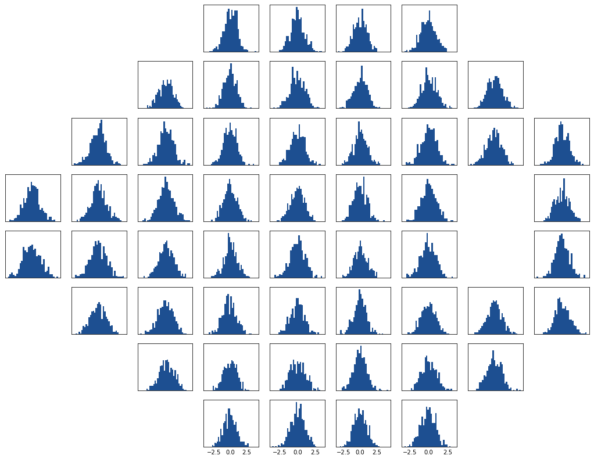

# 24-2 Visual Field Plot

This is a brief overview describing how to generate a 24-2 visual field plot.


```python
# Import packages
import numpy as np
import pandas as pd
import matplotlib.pyplot as plt
%matplotlib inline
```

First let us import a table that maps (x, y) coordinates to (i, j) coordinates.


```python
vf_map = pd.read_csv('./vf_map.csv')
```

Now we will use this table to determine where to plot.

In this example I will plot dummy data. To plot your data, you can either:

1. Join the `vf_map` to your data (on the `x` and `y` variables) then subset your data by `i` and `j` within the `for` loop
2. Extract the `x` and `y` coordinates from the `vf_map` at each iteration of the `for` loop then subset your data based on these values.


```python
# Define subplot
fig, ax = plt.subplots(8, 9, sharex='col', sharey='row', figsize=(18, 14))

# Loop through rows and columns
for i in range(8):
    for j in range(9):
        # Check subplot coordinates against vf_map coordinates
        loc = (vf_map.i == i) & (vf_map.j == j)
        
        # Generate plot if coordinates are present, otherwise remove the subplot
        if any(loc):
            # Change these values
            data = np.random.randn(500) # replace with your data
            bins = 30 # you can instead use np.arange(-1, 2, 0.1) for fixed-width bins
    
            # Plot
            ax[i,j].hist(data, bins = bins, color = '#1D4F91')    
            
            # Remove ticks and ylabel
            ax[i,j].tick_params(length = 0)
            ax[i,j].set_yticklabels([])
            
        else:
            ax[i,j].remove()
           
# # You can save the plot as follows:
# plt.savefig('tmp.png', dpi = 300) 
```





That's it!

We can adjust the spacing, add a title, save the plot, as desired.
